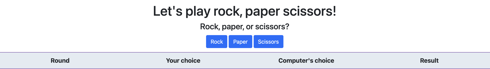
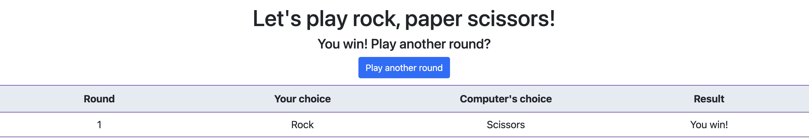

# Rock Paper Scissors
A simple implementation of the rock paper scissors game, using HTML, CSS and JavaScript

# The landing page
When you fire up the webpage, you will be greeted with a title asking you to play a game of rock, paper scissors.

Click the blue button which says _Begin a game_ to start playing!

# The game begins!
Choose any of the options: Rock, paper or scissors and try your luck against the computer!

# Play again
You can choose to play again as many times as you wish. After a round, a blue button will appear, saying _Play again_, and you may choose to click it and play another round

A 9-round game example:
